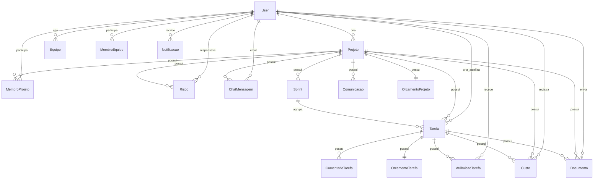

# Database Review - Backend Planify

Este documento registra o review inicial dos models atuais para a refatoração multi-tenant.

## Classificação por app

| App | Models | Escopo recomendado | Motivo |
| --- | --- | --- | --- |
| `users` | `User` | `public` | Identidade global para permitir acesso a mais de uma empresa. |
| `users` | `UserProfile` | `public` | Preferências pessoais do usuário, não dados de negócio. |
| `users` | `AccessProfile`, `Permission`, `UserAccessProfile` | Híbrido | Hoje são globais, mas permissões efetivas precisam ser por tenant ou ligadas a membership. |
| `users` | `PasswordHistory`, `AccessAttempt` | `public` | Auditoria e segurança da identidade global. `AccessAttempt` deve ganhar contexto de tenant quando existir. |
| `projects` | `Projeto`, `MembroProjeto`, `HistoricoStatusProjeto`, `Sprint` | `tenant` | Dados centrais de negócio por empresa. |
| `tasks` | `Tarefa`, `AtribuicaoTarefa`, `ComentarioTarefa`, `HistoricoStatusTarefa` | `tenant` | Dependem de projeto/sprint e representam trabalho interno do tenant. |
| `teams` | `Equipe`, `MembroEquipe`, `PermissaoEquipe` | `tenant` | Estrutura operacional da empresa. |
| `risks` | `Risco`, `HistoricoRisco` | `tenant` | Dependem de projeto. |
| `costs` | `Categoria`, `Custo`, `OrcamentoProjeto`, `OrcamentoTarefa`, `Alerta` | `tenant` | Custos, categorias e orçamentos devem ser isolados por empresa. |
| `documents` | `Documento`, `HistoricoDocumento`, `Comentario` | `tenant` | Arquivos e comentários vinculados a projeto/tarefa. |
| `communications` | `ChatMensagem`, `ChatMensagemLeitura`, `Notificacao`, `ConfiguracaoNotificacao`, `Comunicacao` | Híbrido | Mensagens/comunicações são tenant; configurações pessoais podem ser globais ou por tenant. Notificações precisam decisão por contexto. |
| `core` | Sem models detectados | `shared` | App de endpoints agregadores, saúde e dashboard. Deve consultar tenant quando necessário. |

## Relacionamentos principais

## Models que apontam para `settings.AUTH_USER_MODEL`

- `projects.Projeto.criado_por`
- `projects.MembroProjeto.usuario`
- `projects.HistoricoStatusProjeto.alterado_por`
- `projects.Sprint.criado_por`
- `tasks.Tarefa.criado_por`
- `tasks.Tarefa.atualizado_por`
- `tasks.AtribuicaoTarefa.usuario`
- `tasks.AtribuicaoTarefa.atribuido_por`
- `tasks.ComentarioTarefa.autor`
- `tasks.HistoricoStatusTarefa.alterado_por`
- `teams.Equipe.criado_por`
- `teams.MembroEquipe.usuario`
- `teams.MembroEquipe.adicionado_por`
- `risks.Risco.responsavel_mitigacao`
- `risks.Risco.criado_por`
- `risks.HistoricoRisco.alterado_por`
- `costs.Custo.criado_por`
- `costs.OrcamentoProjeto.aprovado_por`
- `costs.OrcamentoTarefa.aprovado_por`
- `costs.Alerta.resolvido_por`
- `documents.Documento.enviado_por`
- `documents.HistoricoDocumento.alterado_por`
- `documents.Comentario.autor`
- `communications.ChatMensagem.autor`
- `communications.ChatMensagemLeitura.usuario`
- `communications.Notificacao.usuario`
- `communications.ConfiguracaoNotificacao.usuario`
- `communications.Comunicacao.remetente`
- `communications.Comunicacao.destinatarios`
- `users.UserProfile.user`
- `users.UserAccessProfile.user`
- `users.PasswordHistory.user`
- `users.AccessAttempt.user`

## Constraints e unicidade relevantes

- `projects.Projeto.titulo` é `unique=True`. Em multi-tenant, essa unicidade deve ser por schema, não global.
- `projects.MembroProjeto` tem `UniqueConstraint(projeto, usuario)`.
- `projects.Sprint` tem `unique_together = (projeto, nome)`.
- `tasks.AtribuicaoTarefa` tem `unique_together = (tarefa, usuario)`.
- `teams.MembroEquipe` tem `unique_together = (equipe, usuario)`.
- `teams.PermissaoEquipe` tem `unique_together = (papel, equipe, modulo, permissao)`.
- `users.User.email` e `users.User.username` são globais e únicos.
- `users.Permission` tem `unique_together = (access_profile, module, action)`.
- `users.UserAccessProfile` tem `unique_together = (user, access_profile)`.
- `communications.ChatMensagemLeitura` tem `unique_together = (mensagem, usuario)`.

## Dependências circulares ou pontos de atenção

- `projects.Projeto` possui `ForeignKey` para `costs.Custo`, enquanto `costs.Custo` possui `ForeignKey` para `projects.Projeto`. Essa dependência cruzada deve ser revisada antes da separação em apps tenant.
- Vários apps importam diretamente `Projeto`, `Sprint` e `Tarefa` em vez de usar strings de relacionamento. Isso aumenta acoplamento durante migrações.
- Os testes esperam `Project`, mas o model real é `Projeto`. Essa divergência deve ser resolvida antes de ampliar a suite tenant.
- `communications.Notificacao` aponta opcionalmente para `Projeto` e `Tarefa`, mas também é por usuário. A decisão de escopo precisa evitar notificações globais vazando dados de tenant.
- `communications.ConfiguracaoNotificacao` é `OneToOne` com usuário. Se a preferência for diferente por empresa, esse model deve migrar para membership/configuração tenant.
- Permissões atuais (`AccessProfile`, `Permission`, `UserAccessProfile`) não carregam contexto de empresa. O modelo não atende isolamento de roles por tenant sem nova camada.

## Riscos de migração

- Separar usuário global de dados tenant exige que FKs tenant para `users.User` sejam compatíveis com `django-tenants`.
- O histórico e auditoria usam referências diretas a usuário; usuários removidos ou sem membership podem deixar dados inconsistentes.
- Arquivos em `media/` ainda não têm particionamento por tenant.
- Dados atuais não indicam empresa destino. Antes da migração real, será necessário definir um tenant padrão para todos os dados existentes.
- Views e serializers podem filtrar por usuário, projeto ou equipe sem considerar tenant atual.
- O admin pode registrar models tenant no contexto errado se `SHARED_APPS` e `TENANT_APPS` forem configurados sem revisão.
