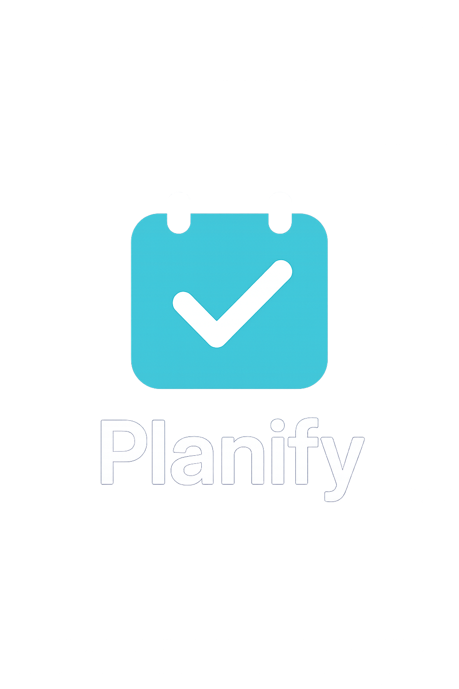

# Planify - Sistema de Gerenciamento de Projetos



Planify é uma aplicação web completa para gerenciamento de projetos, desenvolvida com Nuxt 3 (frontend) e Django REST Framework (backend). O sistema permite o gerenciamento completo de projetos, tarefas, equipes, riscos, custos, documentos e comunicações, com controle de acesso baseado em papéis (RBAC).

## 🚀 Tecnologias

- **Frontend**: Nuxt 3, Vue 3, TypeScript, Tailwind CSS
- **Gerenciamento de Estado**: Pinia
- **Requisições HTTP**: Cliente API auto-gerado via OpenAPI
- **Componentes UI**: Biblioteca personalizada + Lucide Icons
- **Formulários**: Validação integrada
- **Autenticação**: JWT com refresh tokens
- **Temas**: Suporte completo a modo claro/escuro

## 📁 Estrutura do Projeto

### Configurações Otimizadas

O projeto foi configurado com as seguintes otimizações:

#### Nuxt Config (`nuxt.config.ts`)
- ✅ Auto-imports configurados para `services`, `stores`, `composables`
- ✅ Aliases otimizados para melhor DX
- ✅ Componentes com prefixos organizados (`Ui`, `Shared`, `Business`)
- ✅ Plugins carregados em ordem específica
- ✅ Runtime config expandido com variáveis de ambiente
- ✅ SEO otimizado com meta tags

#### Plugins Melhorados
- **API Plugin**: Configuração robusta com interceptors e timeout
- **Auth Plugin**: Middleware de autenticação e helpers
- **Icons Plugin**: Mapeamento inteligente de ícones Phosphor/Lucide

### Diretórios Principais

```
frontend/
├── assets/            # Recursos estáticos (CSS, imagens)
├── components/        # Componentes Vue reutilizáveis
├── composables/       # Composables Vue para lógica reutilizável
├── docs/              # Documentação adicional
├── layouts/           # Layouts da aplicação
├── lib/               # Bibliotecas e utilitários
├── middleware/        # Middleware Nuxt
├── pages/             # Páginas da aplicação (rotas automáticas)
├── plugins/           # Plugins Nuxt
├── public/            # Arquivos públicos
├── server/            # API e middleware do servidor
├── services/          # Serviços de API e lógica de negócios
├── stores/            # Stores Pinia e composables de estado
└── tests/             # Testes automatizados
```

### Detalhamento dos Diretórios

#### `/assets`
Contém recursos estáticos como CSS global, imagens e fontes.

#### `/components`
Componentes Vue reutilizáveis organizados por funcionalidade:

- `/components/ui/` - Componentes de UI básicos (button, card, avatar, badge, etc.)
- `/components/form/` - Componentes de formulário (inputs, selects, etc.)
- `/components/layout/` - Componentes de layout (header, sidebar, footer)
- `/components/data/` - Componentes para exibição de dados (tabelas, gráficos)
- `/components/modal/` - Componentes de modal e diálogos

#### `/composables`
Composables Vue para lógica reutilizável, como hooks para API, autenticação e notificações.

#### `/docs`
Documentação adicional, incluindo documentação da API e fluxos de autenticação.

#### `/layouts`
Layouts da aplicação, incluindo layout principal, layout de autenticação e layout de dashboard.

#### `/lib`
Bibliotecas e utilitários, como funções de formatação, validação e helpers.

#### `/middleware`
Middleware Nuxt para autenticação e outras verificações de rota.

#### `/pages`
Páginas da aplicação organizadas por funcionalidade, com rotas automáticas do Nuxt:

- `/pages/auth/` - Páginas de autenticação (login, registro, recuperação de senha)
- `/pages/projetos/` - Páginas de gerenciamento de projetos
- `/pages/tarefas/` - Páginas de gerenciamento de tarefas
- `/pages/equipes/` - Páginas de gerenciamento de equipes
- `/pages/riscos/` - Páginas de gerenciamento de riscos
- `/pages/custos/` - Páginas de gerenciamento de custos
- `/pages/documentos/` - Páginas de gerenciamento de documentos
- `/pages/comunicacoes/` - Páginas de comunicação

#### `/plugins`
Plugins Nuxt para configuração global, como API, autenticação e notificações.

#### `/public`
Arquivos públicos, como favicon, logo e outros recursos estáticos.

#### `/server`
API e middleware do servidor Nuxt.

#### `/services`
Serviços de API e lógica de negócios:

- `/services/api/` - Cliente API e configuração Axios
- `/services/api/endpoints/` - Endpoints da API
- `/services/api/services/` - Serviços específicos (projectService, taskService, etc.)

#### `/stores`
Stores Pinia e composables de estado para gerenciamento de estado global.

#### `/tests`
Testes automatizados para componentes, serviços e páginas.

## Configuração e Instalação

### Pré-requisitos

- Node.js (v16+)
- npm, yarn ou pnpm

### Instalação

1. Clone o repositório

```bash
git clone https://github.com/seu-usuario/planify.git
cd planify/frontend
```

2. Instale as dependências

```bash
# npm
npm install

# yarn
yarn install

# pnpm
pnpm install
```

3. Configure as variáveis de ambiente

Copie o arquivo `.env.example` para `.env` e ajuste as variáveis conforme necessário:

```bash
cp .env.example .env
```

Exemplo de configuração do `.env`:

```
NUXT_PUBLIC_API_BASE_URL=http://localhost:8000/api
NUXT_PUBLIC_APP_NAME=Planify
```

## Desenvolvimento

Inicie o servidor de desenvolvimento:

```bash
# npm
npm run dev

# yarn
yarn dev

# pnpm
pnpm dev
```

O servidor de desenvolvimento estará disponível em `http://localhost:3000`.

## Produção

### Build

Gere a build de produção:

```bash
# npm
npm run build

# yarn
yarn build

# pnpm
pnpm build
```

### Preview local

Previsualização da build de produção:

```bash
# npm
npm run preview

# yarn
yarn preview

# pnpm
pnpm preview
```

### Deployment

O Planify pode ser implantado em qualquer serviço que suporte aplicações Nuxt/Node.js. Consulte a [documentação de deployment do Nuxt](https://nuxt.com/docs/getting-started/deployment) para mais informações.

## Autenticação e Autorização

O Planify utiliza um sistema de autenticação baseado em JWT (JSON Web Tokens) e controle de acesso baseado em papéis (RBAC).

### Fluxo de Autenticação

1. Login: O usuário fornece credenciais (email/senha) e recebe tokens de acesso e refresh
2. Autorização: O token de acesso é usado para autorizar requisições à API
3. Renovação: O token de refresh é usado para obter um novo token de acesso quando o atual expira
4. Logout: Os tokens são invalidados no servidor e removidos do cliente

### Papéis de Usuário

- **Admin**: Acesso completo a todas as funcionalidades
- **Manager**: Pode criar e gerenciar projetos, tarefas, equipes, etc.
- **Editor**: Pode editar projetos e tarefas, mas não pode criar ou excluir
- **Viewer**: Acesso somente leitura

### Exemplo de Verificação de Permissão

```typescript
// Verificação de permissão em um componente Vue
const { user } = useAuth()

const userCanCreate = computed(() => {
  return ['admin', 'manager'].includes(user.value?.role)
})

const userCanEdit = computed(() => {
  return ['admin', 'manager', 'editor'].includes(user.value?.role)
})

const userCanDelete = computed(() => {
  return ['admin', 'manager'].includes(user.value?.role)
})
```

## API e Serviços

O Planify utiliza uma arquitetura de serviços para comunicação com a API backend.

### Estrutura de Serviços

- `apiClient.ts`: Configuração do cliente Axios
- `endpoints.ts`: Definição de endpoints da API
- Serviços específicos: Implementam a lógica de negócios e comunicação com a API

### Exemplo de Serviço

```typescript
// services/api/services/projectService.ts
import { apiClient } from '../apiClient'
import { endpoints } from '../endpoints'
import { useAuth } from '~/stores/composables/useAuth'

export const projectService = {
  async fetchProjetos() {
    return await apiClient.get(endpoints.projetos.list)
  },
  
  async getProjetoById(id) {
    return await apiClient.get(`${endpoints.projetos.detail}${id}/`)
  },
  
  async createProjeto(projeto) {
    const { user } = useAuth()
    // Associa o usuário atual ao projeto
    projeto.criado_por = user.value?.id
    return await apiClient.post(endpoints.projetos.list, projeto)
  },
  
  async updateProjeto(id, projeto) {
    return await apiClient.put(`${endpoints.projetos.detail}${id}/`, projeto)
  },
  
  async deleteProjetoById(id) {
    return await apiClient.delete(`${endpoints.projetos.detail}${id}/`)
  }
}
```

## Componentes UI

O Planify utiliza um sistema de componentes UI personalizados com variantes para manter consistência visual.

### Componentes Principais

- **Button**: Botões com variantes (primary, secondary, outline, ghost)
- **Card**: Cards para exibição de conteúdo
- **Avatar**: Avatares de usuário com variantes de tamanho
- **Badge**: Badges para status e etiquetas
- **Input**: Campos de entrada com validação
- **Select**: Campos de seleção
- **Modal**: Modais para diálogos e formulários
- **DataTable**: Tabela de dados com paginação, ordenação e pesquisa
- **LoadingButton**: Botão com indicador de carregamento
- **SkeletonLoader**: Componente para exibição durante carregamento

### Exemplo de Uso de Componente

```vue
<template>
  <Card>
    <CardHeader>
      <CardTitle>Novo Projeto</CardTitle>
      <CardDescription>Crie um novo projeto</CardDescription>
    </CardHeader>
    <CardContent>
      <form @submit.prevent="handleSubmit">
        <div class="space-y-4">
          <Input v-model="form.nome" label="Nome do Projeto" required />
          <Input v-model="form.descricao" label="Descrição" type="textarea" />
          <Input v-model="form.data_inicio" label="Data de Início" type="date" required />
          <Input v-model="form.data_fim" label="Data de Término" type="date" required />
        </div>
        <div class="mt-6 flex justify-end space-x-2">
          <Button type="button" variant="outline" @click="$emit('cancel')">Cancelar</Button>
          <LoadingButton type="submit" :loading="loading">Salvar</LoadingButton>
        </div>
      </form>
    </CardContent>
  </Card>
</template>
```

## Exemplos de Implementação

### Criação de um Novo Projeto

```typescript
// pages/projetos/index.vue
import { ref } from 'vue'
import { projectService } from '~/services/api/services/projectService'
import { useNotification } from '~/composables/useNotification'

const showNewProjectModal = ref(false)
const loading = ref(false)
const notification = useNotification()
const projects = ref([])

const form = ref({
  nome: '',
  descricao: '',
  data_inicio: '',
  data_fim: '',
  status: 'planejamento'
})

async function fetchProjects() {
  loading.value = true
  try {
    const response = await projectService.fetchProjetos()
    projects.value = response.data
  } catch (error) {
    notification.error('Erro ao carregar projetos')
    console.error(error)
  } finally {
    loading.value = false
  }
}

async function handleSubmit() {
  return notification.withLoading(
    async () => {
      const response = await projectService.createProjeto(form.value)
      projects.value.push(response.data)
      showNewProjectModal.value = false
      resetForm()
      return 'Projeto criado com sucesso'
    },
    {
      loading: 'Criando projeto...',
      error: 'Erro ao criar projeto'
    }
  )
}

function resetForm() {
  form.value = {
    nome: '',
    descricao: '',
    data_inicio: '',
    data_fim: '',
    status: 'planejamento'
  }
}

// Carregar projetos ao montar o componente
onMounted(() => {
  fetchProjects()
})
```

### Implementação de Controle de Acesso Baseado em Papel (RBAC)

```vue
<!-- components/RoleBasedContent.vue -->
<template>
  <div v-if="hasAccess">
    <slot></slot>
  </div>
</template>

<script setup>
import { computed } from 'vue'
import { useAuth } from '~/stores/composables/useAuth'

const props = defineProps({
  roles: {
    type: Array,
    default: () => ['admin']
  }
})

const { user } = useAuth()

const hasAccess = computed(() => {
  if (!user.value) return false
  return props.roles.includes(user.value.role)
})
</script>
```

Uso do componente RBAC:

```vue
<template>
  <div>
    <h1>Lista de Projetos</h1>
    
    <RoleBasedContent :roles="['admin', 'manager']">
      <Button @click="showNewProjectModal = true">Novo Projeto</Button>
    </RoleBasedContent>
    
    <DataTable :data="projects" :columns="columns">
      <template #actions="{ item }">
        <RoleBasedContent :roles="['admin', 'manager', 'editor']">
          <Button size="sm" @click="editProject(item)">Editar</Button>
        </RoleBasedContent>
        
        <RoleBasedContent :roles="['admin', 'manager']">
          <Button size="sm" variant="destructive" @click="deleteProject(item)">Excluir</Button>
        </RoleBasedContent>
      </template>
    </DataTable>
  </div>
</template>
```

## Testes

O Planify utiliza testes automatizados para garantir a qualidade do código.

### Executando Testes

```bash
# npm
npm run test

# yarn
yarn test

# pnpm
pnpm test
```

## Documentação Adicional

- [Documentação da API](/docs/API_DOCUMENTATION.md)
- [Fluxo de Autenticação](/docs/auth-flow.md)
- [Guia de Estilo de Componentes](/docs/component-style-guide.md)

---

© 2025 Planify - Sistema de Gerenciamento de Projetos
